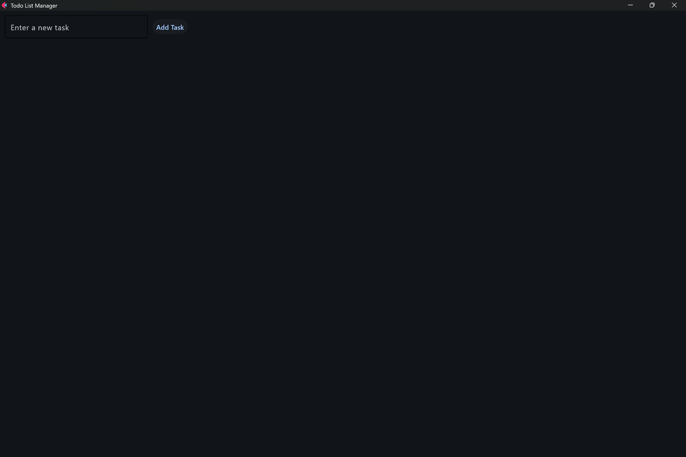
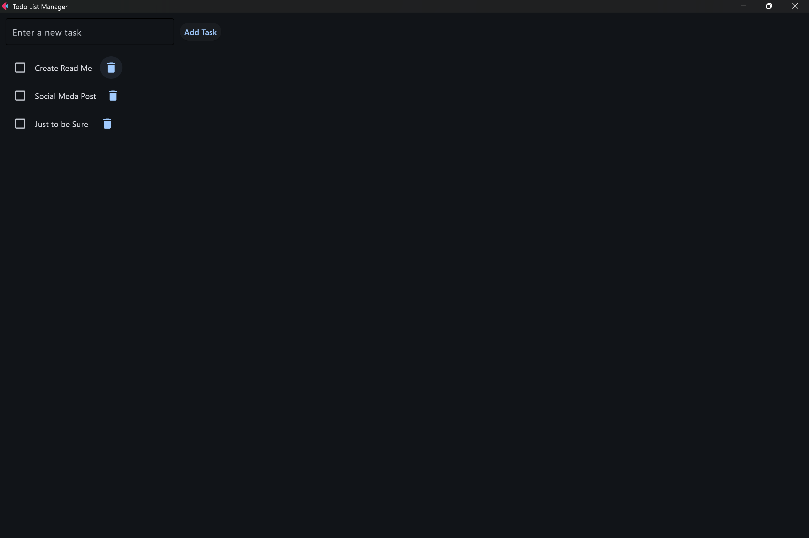
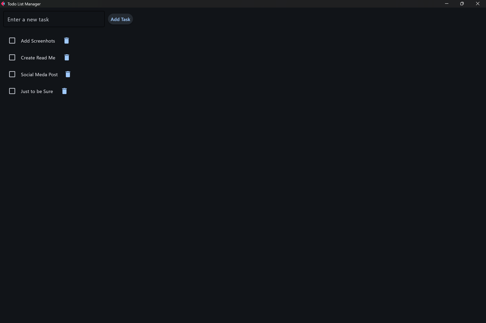
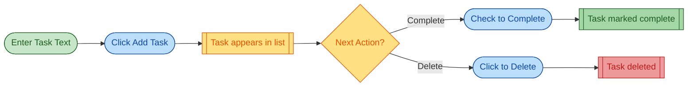

# Todo List Manager

> 🎓 **A learning project exploring Flet** – building a practical desktop app while discovering what makes Flet powerful for Python developers.

A lightweight desktop app built with Python and Flet that lets you capture, complete, and clean up tasks without jumping into a browser or heavyweight productivity suite.

## 🎯 Business Impact

A focused window for the day's work keeps students and solo operators on track, shortens daily planning time, and makes done vs. open tasks instantly visible.

## 🚀 Features

- **Quick task capture** – Add a new task in under 10 seconds
- **Visual completion tracking** – Check off tasks as you complete them
- **Inline delete** – Remove tasks with a simple click
- **Distraction-free interface** – Clean, focused design
- **Offline-first** – Works entirely on your local machine, no cloud required

## 👥 Who Is This For?

- **Students** managing coursework and assignments
- **Freelancers** juggling multiple client tasks
- **Busy professionals** who prefer a focused desktop companion
- **Anyone** tired of scattered to-dos across sticky notes, browser tabs, and phone apps

## 📚 Documentation

- **Source code:** [main.py](main.py)
- **Learning notes:** This README covers the key Flet concepts explored in this project

## 🛠️ Tech Stack

- **Python 3.11+** – Core language
- **Flet 0.24** – Cross-platform UI framework
- **pip/pipx** – Package management
- **virtualenv** – Environment isolation

## 🔍 Why Flet?

This project is a hands-on exploration of **Flet**, a framework that lets you build cross-platform apps (desktop, web, mobile) using pure Python—no HTML, CSS, or JavaScript required.

### What Makes Flet Interesting?

**For Python developers who want to build UIs:**
- **Pure Python** – Write UI code the same way you write any Python code
- **Hot reload** – See changes instantly without restarting the app
- **Cross-platform** – Same codebase runs on Windows, macOS, Linux, web, iOS, and Android
- **Flutter-powered** – Built on Google's Flutter, so you get modern, native-feeling UIs
- **No frontend skills needed** – If you know Python, you can build desktop apps

### What I'm Learning Through This Project

- **Event-driven architecture** – How Flet handles user interactions (clicks, text input, checkboxes)
- **State management** – Keeping the UI in sync with data changes
- **Flet's component model** – Using `TextField`, `Checkbox`, `ElevatedButton`, `IconButton`, and layout containers
- **UI responsiveness** – Managing task lists that grow dynamically
- **Python-first UI development** – Building interfaces without leaving the Python ecosystem

### Why This Matters

Traditional Python desktop apps required learning Tkinter (dated), PyQt (complex licensing), or Electron (JavaScript required). Flet offers a modern alternative that feels natural to Python developers while producing professional-looking apps.

## 📦 Setup

### Prerequisites
- Python 3.11 or higher
- pip (Python package installer)

### Installation

1. **Clone the repository**
   ```bash
   git clone https://github.com/Rashad1019/TO_DO_LIST.git
   cd TO_DO_LIST
   ```

2. **Create and activate a virtual environment**
   
   **macOS/Linux:**
   ```bash
   python -m venv .venv
   source .venv/bin/activate
   ```
   
   **Windows (PowerShell):**
   ```powershell
   python -m venv .venv
   .venv\Scripts\Activate.ps1
   ```
   
   **Windows (Command Prompt):**
   ```cmd
   python -m venv .venv
   .venv\Scripts\activate.bat
   ```

3. **Install dependencies**
   ```bash
   pip install -r requirements.txt
   ```

4. **Run the app**
   ```bash
   python main.py
   ```

## 💡 Usage

1. **Launch the app** – Run `python main.py`
2. **Add a task** – Type your task in the text field and click "Add Task"
3. **Complete a task** – Check the checkbox next to the task
4. **Delete a task** – Click the trash icon to remove it

---

## 📸 Screenshots

> Each image is on its own line to avoid crowding. Adjust widths as you like.

### Main Interface


### Task Workflow


### Before and After Completion



---

## 🗺️ Workflow Diagram



---

## 📊 Success Metrics

This app is designed to help you:
- Capture a new task in **<10 seconds** from app launch
- Check off or delete **≥90% of tasks** without scrolling
- Manage at least **15 tasks per session** before UI clutter appears

## ⚠️ Current Limitations

- **Local-only storage** – Tasks reset when you close the app (persistence coming in a future version)
- **Single-window layout** – Designed for focused, session-based task management
- **Flet dependency** – Requires the Flet runtime to be installed

## 🔮 Future Enhancements

- [ ] Persistent storage (JSON or SQLite)
- [ ] Task categories or tags
- [ ] Keyboard shortcuts
- [ ] Dark mode
- [ ] Task sorting and filtering
- [ ] Export tasks to CSV/text file
- [ ] Cross-session task persistence

## 📚 Flet Learning Resources

If you're interested in exploring Flet yourself:

- **Official Docs:** [flet.dev/docs](https://flet.dev/docs)
- **Flet Gallery:** [gallery.flet.dev](https://gallery.flet.dev) – Interactive examples you can run
- **GitHub:** [github.com/flet-dev/flet](https://github.com/flet-dev/flet)
- **Discord Community:** [discord.gg/dzWXP8SHG8](https://discord.gg/dzWXP8SHG8)
- **Tutorial Series:** [flet.dev/docs/tutorials](https://flet.dev/docs/tutorials)

### Key Flet Concepts Demonstrated in This Project

1. **Page management** – Setting up the main app window
2. **Control composition** – Building UI from Flet components
3. **Event handlers** – Responding to user actions (`on_click`, `on_change`)
4. **State updates** – Using `page.update()` to refresh the UI
5. **Layout containers** – Organizing components with `Column`, `Row`, etc.

## 🤝 Contributing

This is a learning project, and contributions are welcome! Whether you're also exploring Flet or have ideas for improvements, feel free to:

- Open an issue to discuss new features or bugs
- Submit a pull request with improvements
- Share your own Flet learning experiences
- Suggest better ways to structure Flet apps

Check the [issues page](https://github.com/Rashad1019/TO_DO_LIST/issues) to see what's being worked on.

## 📝 License

This project is open source and available under the [MIT License](LICENSE).

## 📧 Contact

**Rasha** – [Rashad12x@outlook.com](mailto:Rashad12x@outlook.com)

*Building this to learn Flet and share the journey. If you're exploring Flet too, let's connect!*

---

⭐ If you find this project helpful for learning Flet, please consider giving it a star on GitHub!
